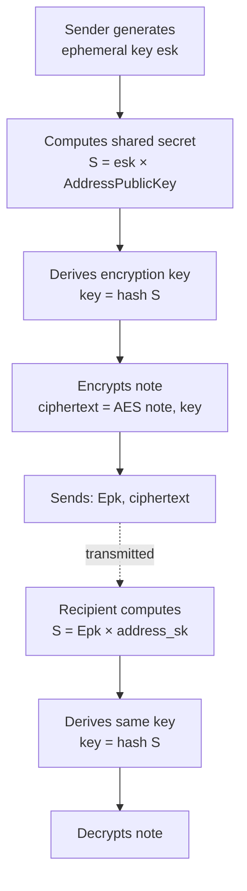

import Image from "@theme/IdealImage";

## Account Keys in Aztec

Unlike traditional blockchains where accounts use a single key pair, Aztec accounts use **multiple specialized key pairs**, each serving a distinct cryptographic purpose. This separation is fundamental to Aztec's privacy model and enables powerful security features that aren't possible with single-key systems.

## Why Multiple Keys?

The separation of keys in Aztec serves critical purposes:

- **Privacy isolation**: Different keys for different operations prevent correlation attacks
- **Selective disclosure**: Share viewing access without compromising spending ability
- **Damage limitation**: If one key is compromised, others remain secure
- **Flexible authorization**: Choose any authentication method without affecting core protocol keys
- **Per-application security**: Keys can be scoped to specific contracts to minimize exposure

This multi-key architecture is what enables Aztec to provide strong privacy guarantees while maintaining flexibility and security.

## The Four Key Types

Each Aztec account is backed by four distinct key pairs:

| Key Type | Purpose | Protocol Managed | Rotatable |
|----------|---------|-----------------|-----------|
| **Nullifier Keys** | Spending notes (destroying private state) | Yes | No |
| **Incoming Viewing Keys** | Decrypting received notes | Yes | No |
| **Signing Keys** | Transaction authorization | No (app-defined) | Yes |
| **Address Keys** | Address derivation and note encryption setup | Yes | No |

The first three key pairs are embedded into the protocol and cannot be changed once an account is created. The signing key is abstracted to the account contract developer, allowing complete flexibility in authentication methods.

### Nullifier Keys

**Purpose**: Spending notes (private state consumption)

Nullifier keys enable spending private notes. When using a note (like spending a token), the spender must prove they have the right to nullify it - essentially marking it as "spent" without revealing which note is being spent.

**How it works:**

1. Each account has a master nullifier key pair (`Npk_m`, `nsk_m`)
2. For each application, an **app-siloed** key is derived: `nsk_app = hash(nsk_m, app_contract_address)`
3. To spend a note, compute its nullifier using the note hash and app-siloed key
4. The protocol verifies the app-siloed key comes from your master key and that your master public key is in your address

This ensures only the rightful owner can spend notes, while the app-siloing provides additional security isolation between contracts.

:::tip

This last point could be confusing for most developers: how could a protocol verify a secret key is derived from another secret key without knowing it? Well, _you_ make that derivation, generating a ZK proof for it. The protocol just verifies that ZK proof!

:::

### Incoming Viewing Keys

**Purpose**: Receiving and decrypting private notes

Incoming viewing keys enable private information to be shared with recipients. The sender uses the recipient's public viewing key (`Ivpk`) to encrypt notes, and the recipient uses their secret viewing key (`ivsk`) to decrypt them.

**The encryption flow:**



This uses elliptic curve Diffie-Hellman: both parties compute the same shared secret `S`, but only the recipient has the private key needed to decrypt.

Like nullifier keys, incoming viewing keys are **app-siloed** for each contract, enabling per-application auditability - you can share a viewing key for one app without exposing your activity in others.

### Signing Keys

**Purpose**: Transaction authorization (optional, application-defined)

Unlike the previous three key types which are protocol-mandated, signing keys are **completely abstracted** - thanks to [native account abstraction](../accounts/index.md), any authorization method can be implemented:

- **Signature-based**: ECDSA, Schnorr, BLS, multi-signature
- **Biometric**: Face ID, fingerprint
- **Web2 credentials**: Google OAuth, passkeys
- **Custom logic**: Time locks, spending limits, multi-party authorization

**Traditional signature approach:**

When using signatures, the account contract validates the signature against a stored public key. Here's an example from the Schnorr account contract:

#include_code is_valid_impl noir-projects/noir-contracts/contracts/account/schnorr_account_contract/src/main.nr rust

The flexibility of signing key storage and rotation is entirely up to your account contract implementation.

### Address Keys

**Purpose**: Address derivation and note encryption setup

Address keys are the foundation for [deterministic address computation](../accounts/index.md#address-derivation). They enable a critical feature: anyone can encrypt notes to your address without needing additional keys, just your address.

The address key pair consists of:

- Private key: `address_sk = pre_address + ivsk`
- Public key: `AddressPublicKey = address_sk * G` (elliptic curve point)

#### How Addresses are Computed

The `pre_address` binds together your keys and account contract code, making each address unique and deterministic:

<Image img={require("@site/static/img/address_derivation.png")} />

```
pre_address = hash(public_keys_hash, partial_address)

where:
  public_keys_hash = hash(Npk_m, Ivpk_m, Ovpk_m, Tpk_m)
  partial_address = hash(contract_class_id, salted_initialization_hash)
  contract_class_id = hash(artifact_hash, fn_tree_root, public_bytecode_commitment)
  salted_initialization_hash = hash(deployer_address, salt, constructor_hash)
```

This derivation ensures:

- Your address is deterministic (can be computed before deployment)
- Keys and contract code are cryptographically bound to the address
- The address proves ownership of the nullifier key needed to spend notes

:::note
While the `Ovpk` (outgoing viewing key) exists in the protocol, it is not currently used. It's available for future protocol upgrades or custom implementations.
:::

## Key Management

### Key Generation and Derivation

Protocol keys (nullifier, address, and incoming viewing keys) are automatically generated by the [Private Execution Environment (PXE)](../pxe/index.md) when creating an account. The PXE handles:

- Initial key pair generation
- App-siloed key derivation
- Secure key storage and oracle access
- Key material never leaves the client

All keys use elliptic curve cryptography on the Grumpkin curve:

- Secret keys are scalars
- Public keys are elliptic curve points (secret × generator point)
- Exception: Address private key uses `address_sk = pre_address + ivsk`

Signing keys are application-defined and managed by your account contract logic.

### App-Siloed Keys

Nullifier and incoming viewing keys are **app-siloed** - scoped to each contract that uses them. This provides crucial security isolation:

**How it works:**
```
nsk_app = hash(nsk_m, app_contract_address)
ivsk_app = hash(ivsk_m, app_contract_address)
```

**Security benefits:**

1. **Damage containment**: If a key for one app leaks, other apps remain secure
2. **Selective auditability**: Share viewing access for one app without exposing entire activity
3. **Privacy preservation**: Activity in different apps cannot be correlated via keys

For example, a block explorer could be given a viewing key for a DEX contract to display trades, while keeping activity in other contracts completely private.

### Key Rotation

**Protocol keys (nullifier, address, incoming viewing):** Cannot be rotated. They are embedded in the address, which is immutable. If compromised, a new account must be deployed.

**Signing keys:** Fully rotatable, depending on the account contract implementation. Options include:

- Change keys on a schedule
- Rotate after suspicious activity
- Implement time-delayed rotation for security
- Use different storage patterns that enable rotation (mutable notes, delayed public state, keystore contracts)

## Signing Key Storage Patterns

Since signing keys are application-defined, how the public key is stored is entirely up to the account contract design. Each approach has different trade-offs:

### Immutable Private Note (Recommended for Most Cases)

Stores the key in a private note that is never nullified, providing the best balance of security and cost.

#include_code public_key noir-projects/noir-contracts/contracts/account/schnorr_account_contract/src/main.nr rust

**Pros:**

- No additional cost per transaction
- Key remains private
- Simple implementation

**Cons:**

- Cannot rotate the key
- If key is compromised, must deploy a new account

:::note Wallet Responsibilities
Private note storage relies on wallet infrastructure:

- Wallets must backup all notes for device restoration
- Notes can exist locally (PXE only) or be broadcast encrypted to yourself (exists onchain)
:::

### Mutable Private Note

Stores the key in a note that can be updated, enabling key rotation.

**Pros:**

- Supports key rotation
- Key remains private

**Cons:**

- Each transaction nullifies and recreates the note (expensive)
- Higher cost per transaction

### Delayed Public Mutable State

Stores the key in [delayed public mutable state](../../guides/smart_contracts/how_to_define_storage.md#delayed-public-mutable) - publicly accessible but privately readable with a delay window.

**Pros:**

- Supports key rotation
- No extra nullifiers/commitments per transaction

**Cons:**

- Transactions have time-to-live constraints (determined by delay window)
- Minimum delays restrict rotation frequency
- Key is public

### Keystore Contract

Stores keys in a separate contract that multiple accounts can reference.

**Pros:**

- One keystore serves multiple accounts
- Centralized key management
- No fee overhead (just proving time)

**Cons:**

- Higher proving time per transaction
- More complex architecture

## Non-Account Contracts with Keys

Typically, only account contracts have non-default public keys. However, some contracts like **escrow** or **custodial** contracts need keys even though they aren't accounts.

**Example: Betting Escrow**

A betting contract acts as the "owner" of escrowed funds:

1. The escrow contract has a registered `Npk_m`
2. Both betting participants know the escrow's `nsk_m`
3. Only the winner (who provides proof of winning) can nullify the escrow's notes
4. The contract logic determines who can use the nullifier key

This pattern enables trustless escrow while maintaining privacy - the funds are locked in notes that only the contract's logic can unlock.

## Summary

Aztec's multi-key architecture is fundamental to its privacy and security model:

| Key Type | Purpose | App-Siloed | Rotatable | Managed By |
|----------|---------|------------|-----------|------------|
| **Nullifier** | Spend notes | Yes | No | Protocol (PXE) |
| **Address** | Address derivation | No | No | Protocol (PXE) |
| **Incoming Viewing** | Decrypt received notes | Yes | No | Protocol (PXE) |
| **Signing** | Transaction authorization | N/A | Yes | Application |

**Key takeaways:**

- **Separation enables privacy**: Different keys for different operations prevent correlation and limit damage from compromise
- **App-siloing adds security**: Per-contract keys isolate risk and enable selective disclosure
- **Flexibility in authorization**: Signing keys are completely abstracted - use any authentication method
- **Protocol keys are permanent**: Nullifier, address, and viewing keys are embedded in your address and cannot be changed
- **Client-side security**: All key material is generated and managed in the PXE, never exposed to the network

This architecture allows Aztec to provide strong privacy guarantees while maintaining the flexibility needed for various security models and use cases.
