## Why Bridge an NFT?

Imagine you own a CryptoPunk NFT on Ethereum. You want to use it in games, social apps, or DeFi protocols, but gas fees on Ethereum make every interaction expensive. What if you could move your Punk to Aztec (L2), use it **privately** in dozens of applications, and then bring it back to Ethereum when you're ready to sell?

In this tutorial, you'll build a **private NFT bridge**. By the end, you'll understand how **portals** work and how **cross-chain messages** flow between L1 and L2.

Before starting, make sure you have the Aztec sandbox running at version #include_aztec_version. Check out [the sandbox guide](../../../getting_started_on_sandbox.md) for setup instructions.

## What You'll Build

You'll create two contracts with **privacy at the core**:
- **NFTPunk (L2)** - An NFT contract with encrypted ownership using `PrivateSet`
- **NFTBridge (L2)** - A bridge that mints NFTs privately when claiming L1 messages

This tutorial focuses on the L2 side to keep things manageable. You'll learn the essential privacy patterns that apply to any asset bridge on Aztec.

## Project Setup

Let's start simple. Since this is an Ethereum project, it's easier to just start with Hardhat:

```bash
git clone https://github.com/signorecello/hardhat-aztec-example
```

You're cloning a repo here to make it easier for Aztec's `l1-contracts` to be mapped correctly. You should now have a `hardhat-aztec-example` folder with Hardhat's default starter, with a few changes in `package.json`.

We want to add a few more dependencies now before we start:

```bash
cd hardhat-aztec-example
yarn add @aztec/aztec.js@#include_version_without_prefix @aztec/accounts@#include_version_without_prefix @aztec/stdlib@#include_version_without_prefix @aztec/test-wallet@#include_version_without_prefix tsx
```

Now start the sandbox in another terminal:

```bash
aztec start --sandbox
```

This should start two important services on ports 8080 and 8545, respectively: Aztec and Anvil (an Ethereum development node).

## Part 1: Building the NFT Contract

Let's start with a basic NFT contract on Aztec. That's the representation of the NFT locked on the L2 side:

```mermaid
graph LR
    subgraph Ethereum["Ethereum (L1)"]
        L1NFT["🎨 L1 NFT<br/>(CryptoPunk)"]
        L1Portal["🌉 L1 Portal<br/>(TokenPortal)"]
    end

    subgraph Aztec["Aztec (L2)"]
        L2Bridge["🔗 L2 Bridge<br/>(NFTBridge)"]
        L2NFT["🎭 L2 NFT<br/>(NFTPunk)"]
    end

    L1NFT -->|"Lock NFT"| L1Portal
    L1Portal -->|"L1→L2 Message"| L2Bridge
    L2Bridge -->|"Mint Private"| L2NFT

    L2NFT -.->|"Burn"| L2Bridge
    L2Bridge -.->|"L2→L1 Message"| L1Portal
    L1Portal -.->|"Unlock NFT"| L1NFT

    style L2NFT fill:#4ade80,stroke:#22c55e,stroke-width:3px
    style L2Bridge fill:#f0f0f0,stroke:#999,stroke-width:2px
    style L1Portal fill:#f0f0f0,stroke:#999,stroke-width:2px
    style L1NFT fill:#f0f0f0,stroke:#999,stroke-width:2px

    classDef highlight fill:#4ade80,stroke:#22c55e,stroke-width:3px
```



Let's create that crate in the `contracts` folder so it looks tidy:

```bash
aztec-nargo new --contract contracts/aztec/nft
cd contracts/aztec/nft
```

Open `Nargo.toml` and make sure you add `aztec` as a dependency:

```toml
[dependencies]
aztec = { git = "https://github.com/AztecProtocol/aztec-packages/", tag = "#include_aztec_version", directory = "noir-projects/aztec-nr/aztec" }
```

### Create the NFT Note

First, let's create a custom note type for private NFT ownership. In the `src/` directory, create a new file called `nft.nr`:

```bash
touch src/nft.nr
```

In this file, you're going to create a **private note** that represents NFT ownership. This is a struct with macros that indicate it is a note that can be compared and packed:

#include_code nft_note_struct /docs/examples/tutorials/token_bridge_contract/contracts/aztec/nft/src/nft.nr rust

Now add a `new` method to make creating notes easier. For simplicity, set the randomness within the method. This approach is unsafe because it's unconstrained, but in the current case this won't cause problems:

#include_code nft_note_new /docs/examples/tutorials/token_bridge_contract/contracts/aztec/nft/src/nft.nr rust

You now have a note that represents the owner of a particular NFT. Next, move on to the contract itself.

:::tip Custom Notes

Notes are powerful concepts. Learn more about how to use them in the [notes guide](../../concepts/storage/notes.md).

:::


### Define Storage

Back in `main.nr`, you can now build the contract storage. You need:
- **admin**: Who controls the contract (set once, never changes)
- **minter**: The bridge address (set once by admin)
- **nfts**: Track which NFTs exist (public, needed for bridging)
- **owners**: Private ownership using the NFTNote

One interesting aspect of this storage configuration is the use of `DelayedPublicMutable`, which allows private functions to read and use public state. You're using it to publicly track which NFTs are already minted while keeping their owners private. Read more about `DelayedPublicMutable` in [the storage guide](../../guides/smart_contracts/how_to_define_storage.md).

Write the storage struct and a simple [initializer](../../concepts/smart_contracts/contract_creation.md#initialization) to set the admin in the `main.nr` file:

#include_code contract_setup /docs/examples/tutorials/token_bridge_contract/contracts/aztec/nft/src/main.nr rust


### Utility Functions

Add an internal function to handle the `DelayedPublicMutable` value change. Mark the function as public and internal with [specific macros](../../reference/smart_contract_reference/macros.md):

#include_code mark_nft_exists /docs/examples/tutorials/token_bridge_contract/contracts/aztec/nft/src/main.nr rust

This internal function uses `schedule_value_change` to update the `nfts` storage, preventing the same NFT from being minted twice or burned when it doesn't exist. You'll call this public function from a private function later.

Another useful function checks how many notes a caller has. You can use this later to verify the claim and exit from L2:

#include_code notes_of /docs/examples/tutorials/token_bridge_contract/contracts/aztec/nft/src/main.nr rust

### Add Minting and Burning

Before anything else, you need to set the minter. This will be the bridge contract, so only the bridge contract can mint NFTs. This value doesn't need to change after initialization. Here's how to initialize the `PublicImmutable`:

#include_code set_minter /docs/examples/tutorials/token_bridge_contract/contracts/aztec/nft/src/main.nr rust

Now for the magic - minting NFTs **privately**. The bridge will call this to mint to a user, emit a new [constrained event](../../guides/smart_contracts/how_to_emit_event.md) (best practice when "sending someone a note"), and then [enqueue a public call](../../guides/smart_contracts/how_to_call_contracts.md) to the `_mark_nft_exists` function:

#include_code mint /docs/examples/tutorials/token_bridge_contract/contracts/aztec/nft/src/main.nr rust

The bridge will also need to burn NFTs when users withdraw back to L1:

#include_code burn /docs/examples/tutorials/token_bridge_contract/contracts/aztec/nft/src/main.nr rust

### Compiling!

Let's verify it compiles:

```bash
aztec-nargo compile
```

🎉 You should see "Compiled successfully!" This means our private NFT contract is ready. Now let's build the bridge.

## Part 2: Building the Bridge

We have built the L2 NFT contract. This is the L2 representation of an NFT that is locked on the L1 bridge.

The L2 bridge is the contract that talks to the L1 bridge through cross-chain messaging. You can read more about this protocol [here](../../../docs/concepts/communication/cross_chain_calls.md).

```mermaid
graph LR
    subgraph Ethereum["Ethereum (L1)"]
        L1NFT["🎨 L1 NFT<br/>(CryptoPunk)"]
        L1Portal["🌉 L1 Portal<br/>(TokenPortal)"]
    end

    subgraph Aztec["Aztec (L2)"]
        L2Bridge["🔗 L2 Bridge<br/>(NFTBridge)"]
        L2NFT["🎭 L2 NFT<br/>(NFTPunk)"]
    end

    L1NFT -->|"Lock NFT"| L1Portal
    L1Portal -->|"L1→L2 Message"| L2Bridge
    L2Bridge -->|"Mint Private"| L2NFT

    L2NFT -.->|"Burn"| L2Bridge
    L2Bridge -.->|"L2→L1 Message"| L1Portal
    L1Portal -.->|"Unlock NFT"| L1NFT

    style L2Bridge fill:#4ade80,stroke:#22c55e,stroke-width:3px
    style L2NFT fill:#f0f0f0,stroke:#999,stroke-width:2px
    style L1Portal fill:#f0f0f0,stroke:#999,stroke-width:2px
    style L1NFT fill:#f0f0f0,stroke:#999,stroke-width:2px

    classDef highlight fill:#4ade80,stroke:#22c55e,stroke-width:3px
```



Let's create a new contract in the same tidy `contracts/aztec` folder:

```bash
cd ..
aztec-nargo new --contract nft_bridge
cd nft_bridge
```

And again, add the `aztec-nr` dependency to `Nargo.toml`. We also need to add the `NFTPunk` contract we just wrote above:

```toml
[dependencies]
aztec = { git = "https://github.com/AztecProtocol/aztec-packages/", tag = "#include_aztec_version", directory = "noir-projects/aztec-nr/aztec" }
NFTPunk = { path = "../nft" }
```

### Understanding Bridges

A bridge has two jobs:
1. **Claim**: When someone deposits an NFT on L1, mint it on L2
2. **Exit**: When someone wants to withdraw, burn on L2 and unlock on L1

This means having knowledge about the L2 NFT contract, and the bridge on the L1 side. That's what goes into our bridge's storage.

### Bridge Storage

Clean up `main.nr` which is just a placeholder, and let's write the storage struct and the constructor. We'll use `PublicImmutable` since these values never change:

#include_code bridge_setup /docs/examples/tutorials/token_bridge_contract/contracts/aztec/nft_bridge/src/main.nr rust


You can't initialize the `portal` value in the constructor because the L1 portal hasn't been deployed yet. You'll need another function to set it up after the L1 portal is deployed.

### Adding the Bridge Functions

The Aztec network provides a way to consume messages from L1 to L2 called `consume_l1_to_l2_message`.

You need to define how to encode messages. Here's a simple approach: when an NFT is being bridged, the L1 portal sends a hash of its `token_id` through the bridge, signaling which `token_id` was locked and can be minted on L2. This approach is simple but sufficient for this tutorial.

Build the `claim` function, which consumes the message and mints the NFT on the L2 side:

#include_code claim /docs/examples/tutorials/token_bridge_contract/contracts/aztec/nft_bridge/src/main.nr rust

:::tip Secret

The secret prevents front-running. Certainly you don't want anyone to claim your NFT on the L2 side by just being faster. Adding a secret acts like a "password": you can only claim it if you know it.

:::

Similarly, exiting to L1 means burning the NFT on the L2 side and pushing a message through the protocol. To ensure only the L1 recipient can claim it, hash the `token_id` together with the `recipient`:

#include_code exit /docs/examples/tutorials/token_bridge_contract/contracts/aztec/nft_bridge/src/main.nr rust

Cross-chain messaging on Aztec is powerful because it doesn't conform to any specific format—you can structure messages however you want. Learn more about cross-chain messaging in the [portal reference](../../reference/smart_contract_reference/portals/inbox.md).

:::tip Private Functions

Both `claim` and `exit` are `#[private]`, which means the bridging process is private—nobody can see who's bridging which NFT by watching the chain.

:::

### Compile the Bridge

```bash
aztec-nargo compile
```

Bridge compiled successfully! Now process both contracts and generate TypeScript bindings:

```bash
cd ../nft
aztec-postprocess-contract
aztec codegen target --outdir ../artifacts

cd ../nft_bridge
aztec-postprocess-contract
aztec codegen target --outdir ../artifacts
```

An `artifacts` folder should appear with TypeScript bindings for each contract. You'll use these when deploying the contracts.

## Part 3: The Ethereum Side

Now build the L1 contracts. You need:
- A simple ERC721 NFT contract (the "CryptoPunk")
- A portal contract that locks/unlocks NFTs and communicates with Aztec

### Install Dependencies

Aztec's contracts are already in your `package.json`. You just need to add the OpenZeppelin contracts that provide the default ERC721 implementation:

```bash
cd ../../..
yarn add @openzeppelin/contracts
```

### Create a Simple NFT

Delete the "Counter" contracts that show up by default in `contracts` and create `contracts/SimpleNFT.sol`:

```bash
touch contracts/SimpleNFT.sol
```

Create a minimal NFT contract sufficient for demonstrating bridging:

#include_code simple_nft /docs/examples/tutorials/token_bridge_contract/contracts/SimpleNFT.sol solidity

### Create the NFT Portal

The NFT Portal has more code, so build it step-by-step. Create `contracts/NFTPortal.sol`:

```bash
touch contracts/NFTPortal.sol
```

Initialize it with Aztec's registry, which holds the canonical contracts for Aztec-related contracts, including the Inbox and Outbox. These are the message-passing contracts—Aztec sequencers read any messages on these contracts.

#include_code portal_setup /docs/examples/tutorials/token_bridge_contract/contracts/NFTPortal.sol solidity

The core logic is similar to the L2 logic. `depositToAztec` calls the `Inbox` canonical contract to send a message to Aztec, and `withdraw` calls the `Outbox` contract.

Add these two functions with explanatory comments:

#include_code portal_deposit_and_withdraw /docs/examples/tutorials/token_bridge_contract/contracts/NFTPortal.sol solidity

The portal handles two flows:
- **depositToAztec**: Locks NFT on L1, sends message to L2
- **withdraw**: Verifies L2 message, unlocks NFT on L1


### Compile

Let's make sure everything compiles:

```bash
npx hardhat compile
```

You should see successful compilation of both contracts!

## Part 4: Compiling, Deploying, and Testing

Now deploy everything and test the full flow. This will help you understand how everything fits together.

Delete the placeholders in `scripts` and create `index.ts`:

```bash
touch scripts/index.ts
```

This script will implement the user flow.

:::warning Testnet

This section assumes you're working locally using Sandbox. For the testnet, you need to account for some things:

- Your clients need to point to some Sepolia Node and to the public Aztec Full Node
- You need to [deploy your own Aztec accounts](../../guides/aztec-js/how_to_create_account.md)
- You need to pay fees in some other way. Learn how in the [fees guide](../../guides/aztec-js/how_to_pay_fees.md)

:::


### Deploying and Initializing

First, initialize the clients: `aztec.js` for Aztec and `viem` for Ethereum:

#include_code setup /docs/examples/tutorials/token_bridge_contract/scripts/index.ts typescript

You now have wallets for both chains, correctly connected to their respective chains. Next, deploy the L1 contracts:

#include_code deploy_l1_contracts /docs/examples/tutorials/token_bridge_contract/scripts/index.ts typescript

Now deploy the L2 contracts. Thanks to the TypeScript bindings generated with `aztec codegen`, deployment is straightforward:

#include_code deploy_l2_contracts /docs/examples/tutorials/token_bridge_contract/scripts/index.ts typescript

Now that you have the L2 bridge's contract address, initialize the L1 bridge:

#include_code initialize_portal /docs/examples/tutorials/token_bridge_contract/scripts/index.ts typescript

The L2 contracts were already initialized when you deployed them, but you still need to:

- Tell the L2 bridge about Ethereum's portal address (by calling `set_portal` on the bridge)
- Tell the L2 NFT contract who the minter is (by calling `set_minter` on the L2 NFT contract)

Complete these initialization steps:

#include_code initialize_l2_bridge /docs/examples/tutorials/token_bridge_contract/scripts/index.ts typescript

This completes the setup. It's a lot of configuration, but you're dealing with four contracts across two chains.


### L1 → L2 Flow

Now for the main flow. Mint a CryptoPunk on L1, deposit it to Aztec, and claim it on Aztec. Put everything in the same script. To mint, call the L1 contract with `mint`, which will mint `tokenId = 0`:

#include_code mint_nft_l1 /docs/examples/tutorials/token_bridge_contract/scripts/index.ts typescript

To bridge, first approve the portal address to transfer the NFT, then transfer it by calling `depositToAztec`:

#include_code deposit_to_aztec /docs/examples/tutorials/token_bridge_contract/scripts/index.ts typescript

The `Inbox` contract will emit an important log: `MessageSent(inProgress, index, leaf, updatedRollingHash);`. This log provides the **leaf index** of the message in the [L1-L2 Message Tree](../../concepts/communication/cross_chain_calls.md)—the location of the message in the tree that will appear on L2. You need this index, plus the secret, to correctly claim and decrypt the message.

Use viem to extract this information:

#include_code get_message_leaf_index /docs/examples/tutorials/token_bridge_contract/scripts/index.ts typescript

This extracts the logs from the deposit and retrieves the leaf index. You can now claim it on L2. However, for security reasons, at least 2 blocks must pass before a message can be claimed on L2. If you called `claim` on the L2 contract immediately, it would return "no message available".

Add a utility function to mine two blocks (it deploys a contract with a random salt):

#include_code mine_blocks /docs/examples/tutorials/token_bridge_contract/scripts/index.ts typescript

Now claim the message on L2:

#include_code claim_on_l2 /docs/examples/tutorials/token_bridge_contract/scripts/index.ts typescript

### L2 → L1 Flow

Great! You can expand the L2 contract to add features like NFT transfers. For now, exit the NFT on L2 and redeem it on L1. Mine two blocks because of `DelayedMutable`:

#include_code exit_from_l2 /docs/examples/tutorials/token_bridge_contract/scripts/index.ts typescript

Just like in the L1 → L2 flow, you need to know what to claim on L1. Where in the message tree is the message you want to claim? Use the utility `computeL2ToL1MembershipWitness`, which provides the leaf and the sibling path of the message:

#include_code get_withdrawal_witness /docs/examples/tutorials/token_bridge_contract/scripts/index.ts typescript

With this information, call the L1 contract and use the index and the sibling path to claim the L1 NFT:

#include_code withdraw_on_l1 /docs/examples/tutorials/token_bridge_contract/scripts/index.ts typescript

You can now try the whole flow with:

```typescript
npx hardhat run scripts/index.ts --network localhost
```

## What You Built

A complete private NFT bridge with:

1. **L1 Contracts** (Solidity)
   - `SimpleNFT`: Basic ERC721 for testing
   - `NFTPortal`: Locks/unlocks NFTs and handles L1↔L2 messaging

2. **L2 Contracts** (Noir)
   - `NFTPunk`: Private NFT with encrypted ownership using `PrivateSet`
   - `NFTBridge`: Claims L1 messages and mints NFTs privately

3. **Full Flow**
   - Mint NFT on L1
   - Deploy portal and bridge
   - Lock NFT on L1 → message sent to L2
   - Claim on L2 → private NFT minted
   - Later: Burn on L2 → message to L1 → unlock

## Next Steps

- Add a web frontend for easy bridging
- Implement batch bridging for multiple NFTs
- Add metadata bridging
- Write comprehensive tests
- Add proper access controls

:::tip Learn More
- [Portal reference](../../reference/smart_contract_reference/portals/inbox.md)
- [Notes concepts page](../../concepts/storage/notes.md)
- [Cross-chain messaging](../../concepts/communication/cross_chain_calls.md)
:::
