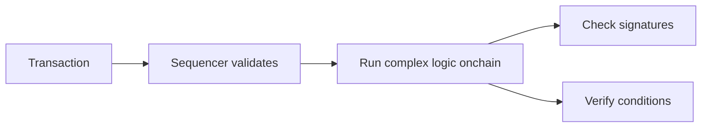
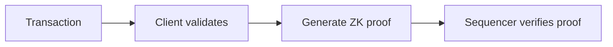
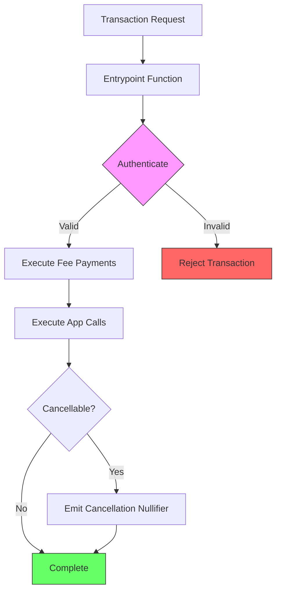
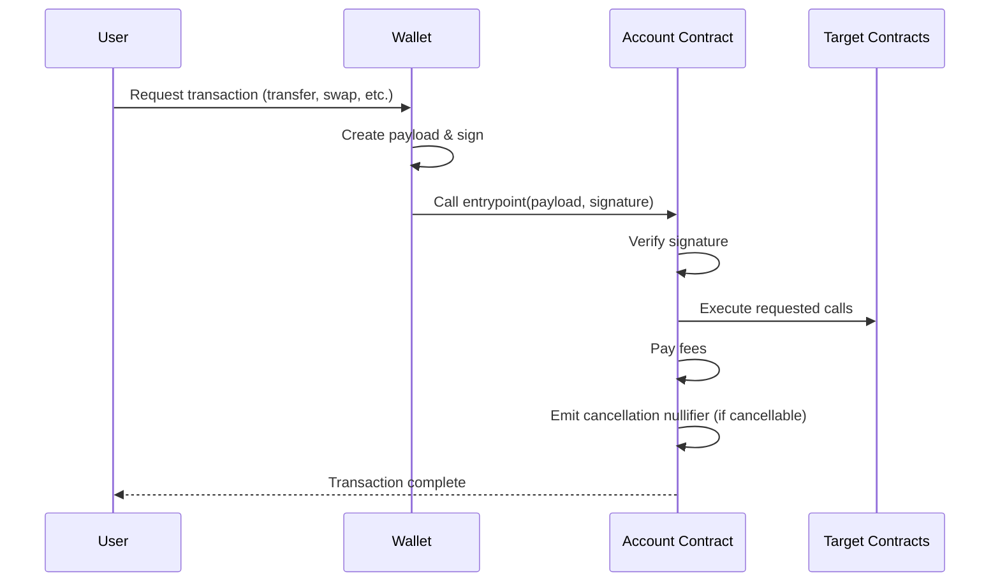

# Understanding Accounts in Aztec

This page provides a comprehensive understanding of how accounts work in Aztec. We'll explore the architecture, implementation details, and the powerful features enabled by Aztec's native account abstraction.

## What is Account Abstraction?

Account abstraction fundamentally changes how we think about blockchain accounts. Instead of accounts being simple key pairs (like in Bitcoin or traditional Ethereum EOAs), accounts become programmable smart contracts that can define their own rules for authentication, authorization, and transaction execution.

### Why Account Abstraction Matters

Traditional blockchain accounts have significant limitations:
- **Rigid authentication**: You lose your private key, you lose everything
- **Limited authorization**: Can't easily implement multi-signature schemes or time-locked transactions
- **Fixed fee payment**: Must pay fees in the native token from the same account
- **No customization**: Can't adapt to different security requirements or use cases

Account abstraction solves these problems by making accounts programmable. This enables:
- **Recovery mechanisms**: Social recovery, hardware wallet backups, time-delayed recovery
- **Flexible authentication**: Biometrics, passkeys, multi-factor authentication, custom signature schemes
- **Fee abstraction**: Pay fees in any token, or have someone else pay for you
- **Custom authorization**: Complex permission systems, spending limits, automated transactions

## Aztec's Native Account Abstraction

Unlike Ethereum where account abstraction is implemented at the application layer (ex. ERC-4337), Aztec has **native account abstraction** at the protocol level. This means:

1. **Every account is a smart contract** - There are no externally owned accounts (EOAs)
2. **Unified experience** - All accounts have the same capabilities and flexibility
3. **Protocol-level support** - The entire network is designed around smart contract accounts
4. **Privacy-first design** - Account abstraction works seamlessly with Aztec's privacy features

### Breaking the DoS Attack Problem

One of the biggest challenges in account abstraction is preventing denial-of-service (DoS) attacks. If accounts can have arbitrary validation logic, malicious actors could flood the network with transactions that are expensive to validate but ultimately invalid.

#### The Traditional Problem

In traditional chains with account abstraction, the sequencer must execute all validation logic onchain:



This creates a fundamental vulnerability: attackers can submit transactions with extremely complex validation logic that consumes significant computational resources, even if the transactions ultimately fail. The sequencer pays the computational cost for every check, making DoS attacks economically viable.

#### Aztec's Solution

Aztec solves this uniquely through zero-knowledge proofs. Instead of executing validation onchain, validation happens client-side:



With this approach:
- **Client performs validation**: All complex logic runs on the user's device
- **Proof generation**: The client generates a succinct ZK proof that validation succeeded
- **Constant verification cost**: The sequencer only verifies the proof - a constant-time operation regardless of validation complexity

This means we can have:

- **Unlimited validation complexity** without affecting network performance
- **Free complex operations** like verifying 100 signatures or checking complex conditions
- **Better privacy** as validation logic isn't visible onchain

## How Aztec Accounts Work

### Account Architecture

Every Aztec account is a smart contract with a specific structure. At its core, an account contract must:

1. **Authenticate transactions** - Verify that the transaction is authorized by the account owner
2. **Execute calls** - Perform the requested operations (transfers, contract calls, etc.)
3. **Manage keys** - Handle the various keys used for privacy and authentication
4. **Handle fees** - Determine how transaction fees are paid

### The Account Contract Structure

Here's the essential structure of an Aztec account contract:



The entrypoint function follows this pattern:

1. **Authentication** - Verify the transaction is authorized (signatures, multisig, etc.)
2. **Fee Payment** - Execute fee payment calls through the fee payload
3. **Application Execution** - Execute the actual application calls
4. **Cancellation Handling** - Optionally emit a nullifier for transaction cancellation

### Address Derivation

Aztec addresses are **deterministic** - they can be computed before deployment. An address is derived from:

```
Address = hash(
    public_keys_hash,    // All the account's public keys
    partial_address      // Contract deployment information
)
```

Where:

- **public_keys_hash** = Combined hash of nullifier, incoming viewing, and other keys
- **partial_address** = Hash of the contract code and deployment parameters

This deterministic addressing enables powerful features:

- **Pre-funding**: Send funds to an address before the account is deployed
- **Counterfactual deployment**: Interact with an account as if it exists, deploy it later
- **Address recovery**: Recompute addresses from known keys

#### Complete Address

While an address alone is sufficient for receiving funds, spending notes requires a **complete address** which includes:

- All the user's public keys (nullifier, incoming viewing, etc.)
- The partial address (contract deployment information)
- The contract address itself

The complete address proves that the nullifier key inside the address is correct, enabling the user to spend their notes.

## Keys and Privacy

Aztec accounts use multiple specialized key pairs instead of a single key like traditional blockchains. This separation enables powerful privacy features:

- Different keys for different purposes (spending, viewing, authorization)
- Per-application key isolation for damage limitation
- Flexible permission models without compromising security

For detailed information about the four key types (nullifier, incoming viewing, address, and signing keys) and how they work together, see the [Keys documentation](./keys.md).

## The Entrypoint Pattern

The entrypoint is the gateway to your account. When someone wants to execute a transaction from your account, they call the entrypoint with a payload describing what to do.

### Transaction Flow

Here's how a transaction flows through an account:



### Non-Standard Entrypoints

The beauty of account abstraction is that not every contract needs authentication. Some contracts can have **permissionless entrypoints**.

For example, a lottery contract where anyone can trigger the payout:

- No authentication required
- Anyone can call the function
- The contract itself handles the logic and constraints

This pattern is useful for:

- **Automated operations**: Keepers can trigger time-based actions
- **Public goods**: Anyone can advance the state of a protocol
- **Gasless transactions**: Users don't need to hold fee tokens

:::info
**msg_sender behavior in different entrypoint contexts:**
- If no contract `entrypoint` is used: `msg_sender` is set to `Field.max`
- In a private to public `entrypoint`: `msg_sender` is the contract making the private to public call
- When calling the `entrypoint` on an account contract: `msg_sender` is set to the account contract address
:::

## Account Lifecycle

### 1. Pre-deployment (Counterfactual State)

Before deployment, an account exists in a **counterfactual state**:
- The address can be computed deterministically
- Can receive funds (notes can be encrypted to the address)
- Cannot send transactions (no code deployed)

### 2. Deployment

Deploying an account involves:
1. Submitting the account contract code
2. Registering in the `ContractInstanceRegistry`
3. Paying deployment fees (either self-funded or sponsored)

```typescript
// Deploy with own fees
await account.deploy().wait();

// Deploy with sponsored fees
await account.deploy({
    fee: { paymentMethod: sponsoredFeePayment }
}).wait();
```

### 3. Initialization

Accounts can be initialized for different purposes:

- **Private-only**: Just needs initialization, no public deployment
- **Public interaction**: Requires both initialization and deployment

The contract is initialized when one of the functions marked with the `#[initializer]` annotation has been invoked. Multiple functions in the contract can be marked as initializers. Contracts may have functions that skip the initialization check (marked with `#[noinitcheck]`).

:::note
Account deployment and initialization are not required to receive notes. The user address is deterministically derived, so funds can be sent to an account that hasn't been deployed yet.
:::

### 4. Active Use

Once deployed and initialized, accounts can:
- Send and receive private notes
- Interact with public and private functions
- Authorize actions via authentication witnesses
- Pay fees in various ways

## Authentication Witnesses (AuthWit)

Aztec replaces Ethereum's dangerous "infinite approval" pattern with **Authentication Witnesses** - a more secure authorization scheme where users sign specific actions rather than granting blanket permissions.

Instead of approving unlimited token transfers, users authorize exact actions with precise parameters. This eliminates persistent security risks while enabling better UX through batched operations.

For detailed information about how AuthWit works in both private and public contexts, see the [Authentication Witness documentation](../advanced/authwit.md).

## Transaction Abstractions

Aztec abstracts two critical components of transactions that are typically rigid in other blockchains: nonces and fees.

### Nonce Abstraction

Unlike Ethereum where nonces are sequential counters enforced by the protocol, Aztec lets account contracts implement their own replay protection.

**Different nonce strategies possible:**

| Strategy | How it Works | Benefits |
|----------|--------------|----------|
| **Sequential** (like Ethereum) | Must use nonces in order (1, 2, 3...) | Simple, predictable ordering |
| **Unordered** (like Bitcoin) | Any unused nonce is valid | Parallel transactions, no blocking |
| **Time-windowed** | Nonces valid only in specific time periods | Automatic expiration, batching |
| **Merkle-tree based** | Nonces from a pre-committed set | Privacy, batch pre-authorization |

This enables:
- **Parallel transactions**: No need to wait for one tx to complete before sending another
- **Custom cancellation**: Define your own rules for replacing/cancelling transactions
- **Flexible ordering**: Implement priority queues, batching, or time-based ordering

### Fee Abstraction

Unlike traditional blockchains where users must pay fees in the native token, Aztec accounts can implement custom fee payment logic:

- **Pay with any token** through integrated swaps
- **Sponsored transactions** where applications pay for users
- **Meta-transactions** with relayer networks
- **Custom payment models** like subscriptions or paymasters

This flexibility is crucial for user onboarding and enables gasless experiences. For detailed information about fee mechanics and payment options, see the [Fees documentation](../fees.md).

## Practical Implementation Patterns

Here are conceptual patterns for different types of accounts:

### Simple Signature Account

**Pattern**: Single key controls the account
- Verify one signature against a stored public key
- Execute transaction if signature is valid
- Similar to traditional EOA but programmable

### Multisig Account

**Pattern**: Multiple keys with threshold requirement
- Store multiple owner public keys
- Require M-of-N signatures to authorize
- Count valid signatures and check threshold
- Useful for shared treasuries or high-security accounts

### Social Recovery Account

**Pattern**: Main key with backup recovery mechanism
- Primary key for normal operations
- Set of recovery keys held by trusted parties
- Recovery process with time delay for security
- Protects against key loss while preventing immediate takeover

### Time-Locked Account

**Pattern**: Transactions with mandatory delay
- Queue transactions with future execution time
- Allow cancellation during waiting period
- Useful for high-value operations or governance

### Session Key Account

**Pattern**: Temporary keys with limited permissions
- Main key delegates limited authority to session keys
- Restrictions on amount, time, or function calls
- Ideal for gaming or automated transactions

## How-to Guides

Ready to implement accounts in your application? Check out these guides:

- [Create an account](../../guides/aztec-js/how_to_create_account.md) - Step-by-step account creation
- [Deploy contracts](../../guides/aztec-js/how_to_deploy_contract.md) - Using your account to deploy contracts
- [Use authentication witnesses](../../guides/aztec-js/how_to_use_authwit.md) - Implement authorization patterns
- [Pay fees](../../guides/aztec-js/how_to_pay_fees.md) - Different fee payment methods
- [Send transactions](../../guides/aztec-js/how_to_send_transaction.md) - Execute transactions from your account

## Summary

Aztec's account abstraction represents a fundamental redesign of how blockchain accounts work:

- **Every account is a smart contract** with customizable logic
- **Multiple specialized keys** provide privacy and security separation
- **Flexible authentication** supports any signature scheme or validation logic
- **Authentication witnesses** replace dangerous approval patterns
- **Abstracted nonces and fees** enable parallel transactions and flexible payment

This creates a platform where users can have accounts that match their security needs, from simple single-signature accounts to complex multi-party governance structures, all while maintaining privacy through zero-knowledge proofs.

The beauty of Aztec's approach is that complexity in validation doesn't increase network costs - whether you're checking one signature or one hundred, the network only verifies a single proof. This opens up possibilities that simply aren't practical on other blockchains.
