## Why Bridge an NFT?

Imagine you own a CryptoPunk NFT on Ethereum. You want to use it in games, social apps, or DeFi protocols, but gas fees on Ethereum make every interaction expensive. What if you could move your Punk to Aztec (L2), use it **privately** in dozens of applications, and then bring it back to Ethereum when you're ready to sell?

In this tutorial, you'll build a **private NFT bridge**. By the end, you'll understand how **portals** work and how **cross-chain messages** flow between L1 and L2.

Before starting, make sure you have the Aztec local network running at version v3.0.0-nightly.20251118. Check out [the local network guide](../../../getting_started_on_local_network.md) for setup instructions.

## What You'll Build

You'll create two contracts with **privacy at the core**:
- **NFTPunk (L2)** - An NFT contract with encrypted ownership using `PrivateSet`
- **NFTBridge (L2)** - A bridge that mints NFTs privately when claiming L1 messages

This tutorial focuses on the L2 side to keep things manageable. You'll learn the essential privacy patterns that apply to any asset bridge on Aztec.

## Project Setup

Let's start simple. Since this is an Ethereum project, it's easier to just start with Hardhat:

```bash
git clone https://github.com/signorecello/hardhat-aztec-example
```

You're cloning a repo here to make it easier for Aztec's `l1-contracts` to be mapped correctly. You should now have a `hardhat-aztec-example` folder with Hardhat's default starter, with a few changes in `package.json`.

We want to add a few more dependencies now before we start:

```bash
cd hardhat-aztec-example
yarn add @aztec/aztec.js@3.0.0-nightly.20251118 @aztec/accounts@3.0.0-nightly.20251118 @aztec/stdlib@3.0.0-nightly.20251118 @aztec/test-wallet@3.0.0-nightly.20251118 tsx
```

Now start the local network in another terminal:

```bash
aztec start --local-network
```

This should start two important services on ports 8080 and 8545, respectively: Aztec and Anvil (an Ethereum development node).

## Part 1: Building the NFT Contract

Let's start with a basic NFT contract on Aztec. That's the representation of the NFT locked on the L2 side:

```mermaid
graph LR
    subgraph Ethereum["Ethereum (L1)"]
        L1NFT["🎨 L1 NFT<br/>(CryptoPunk)"]
        L1Portal["🌉 L1 Portal<br/>(TokenPortal)"]
    end

    subgraph Aztec["Aztec (L2)"]
        L2Bridge["🔗 L2 Bridge<br/>(NFTBridge)"]
        L2NFT["🎭 L2 NFT<br/>(NFTPunk)"]
    end

    L1NFT -->|"Lock NFT"| L1Portal
    L1Portal -->|"L1→L2 Message"| L2Bridge
    L2Bridge -->|"Mint Private"| L2NFT

    L2NFT -.->|"Burn"| L2Bridge
    L2Bridge -.->|"L2→L1 Message"| L1Portal
    L1Portal -.->|"Unlock NFT"| L1NFT

    style L2NFT fill:#4ade80,stroke:#22c55e,stroke-width:3px
    style L2Bridge fill:#f0f0f0,stroke:#999,stroke-width:2px
    style L1Portal fill:#f0f0f0,stroke:#999,stroke-width:2px
    style L1NFT fill:#f0f0f0,stroke:#999,stroke-width:2px

    classDef highlight fill:#4ade80,stroke:#22c55e,stroke-width:3px
```



Let's create that crate in the `contracts` folder so it looks tidy:

```bash
aztec new contracts/aztec/nft
cd contracts/aztec/nft
```

Open `Nargo.toml` and make sure you add `aztec` as a dependency:

```toml
[dependencies]
aztec = { git = "https://github.com/AztecProtocol/aztec-packages/", tag = "v3.0.0-nightly.20251118", directory = "noir-projects/aztec-nr/aztec" }
```

### Create the NFT Note

First, let's create a custom note type for private NFT ownership. In the `src/` directory, create a new file called `nft.nr`:

```bash
touch src/nft.nr
```

In this file, you're going to create a **private note** that represents NFT ownership. This is a struct with macros that indicate it is a note that can be compared and packed:

```rust title="nft_note_struct" showLineNumbers 
use dep::aztec::{
    macros::notes::note,
    protocol_types::{
        address::AztecAddress,
        traits::Packable,
    },
    oracle::random::random,
};

#[derive(Eq, Packable)]
#[note]
pub struct NFTNote {
    owner: AztecAddress,
    randomness: Field,
    token_id: Field,
}
```
> <sup><sub><a href="https://github.com/AztecProtocol/aztec-packages/blob/v3.0.0-nightly.20251118/docs/examples/tutorials/token_bridge_contract/contracts/aztec/nft/src/nft.nr#L1-L18" target="_blank" rel="noopener noreferrer">Source code: docs/examples/tutorials/token_bridge_contract/contracts/aztec/nft/src/nft.nr#L1-L18</a></sub></sup>


Now add a `new` method to make creating notes easier. For simplicity, set the randomness within the method. This approach is unsafe because it's unconstrained, but in the current case this won't cause problems:

```rust title="nft_note_new" showLineNumbers 
impl NFTNote {
    pub fn new(owner: AztecAddress, token_id: Field) -> Self {
        // The randomness preserves privacy by preventing brute-forcing
        NFTNote { owner, randomness: unsafe { random() }, token_id }
    }
}
```
> <sup><sub><a href="https://github.com/AztecProtocol/aztec-packages/blob/v3.0.0-nightly.20251118/docs/examples/tutorials/token_bridge_contract/contracts/aztec/nft/src/nft.nr#L20-L27" target="_blank" rel="noopener noreferrer">Source code: docs/examples/tutorials/token_bridge_contract/contracts/aztec/nft/src/nft.nr#L20-L27</a></sub></sup>


You now have a note that represents the owner of a particular NFT. Next, move on to the contract itself.

:::tip Custom Notes

Notes are powerful concepts. Learn more about how to use them in the [state management guide](../../foundational-topics/state_management.md).

:::


### Define Storage

Back in `main.nr`, you can now build the contract storage. You need:
- **admin**: Who controls the contract (set once, never changes)
- **minter**: The bridge address (set once by admin)
- **nfts**: Track which NFTs exist (public, needed for bridging)
- **owners**: Private ownership using the NFTNote

One interesting aspect of this storage configuration is the use of `DelayedPublicMutable`, which allows private functions to read and use public state. You're using it to publicly track which NFTs are already minted while keeping their owners private. Read more about `DelayedPublicMutable` in [the storage guide](../../aztec-nr/framework-description/how_to_define_storage.md).

Write the storage struct and a simple [initializer](../../foundational-topics/contract_creation.md#initialization) to set the admin in the `main.nr` file:

```rust title="contract_setup" showLineNumbers 
use aztec::macros::aztec;
pub mod nft;

#[aztec]
pub contract NFTPunk {
    use dep::aztec::{
        macros::{storage::storage, functions::{external, utility, initializer, only_self}},
        protocol_types::{address::AztecAddress},
        state_vars::{PrivateSet, PublicImmutable, delayed_public_mutable::DelayedPublicMutable, Map}
    };
    use crate::nft::NFTNote;
    use dep::aztec::messages::message_delivery::MessageDelivery;
    use aztec::note::{note_getter_options::NoteGetterOptions, note_interface::NoteProperties, note_viewer_options::NoteViewerOptions};
    use aztec::utils::comparison::Comparator;

    #[storage]
    struct Storage<Context> {
        admin: PublicImmutable<AztecAddress, Context>,
        minter: PublicImmutable<AztecAddress, Context>,
        nfts: Map<Field, DelayedPublicMutable<bool, 2, Context>, Context>,
        owners: Map<AztecAddress, PrivateSet<NFTNote, Context>, Context>,
    }
    #[external("public")]
    #[initializer]
    fn constructor(admin: AztecAddress) {
        self.storage.admin.initialize(admin);
    }
```
> <sup><sub><a href="https://github.com/AztecProtocol/aztec-packages/blob/v3.0.0-nightly.20251118/docs/examples/tutorials/token_bridge_contract/contracts/aztec/nft/src/main.nr#L1-L29" target="_blank" rel="noopener noreferrer">Source code: docs/examples/tutorials/token_bridge_contract/contracts/aztec/nft/src/main.nr#L1-L29</a></sub></sup>


### Utility Functions

Add an internal function to handle the `DelayedPublicMutable` value change. Mark the function as public and internal with [specific macros](../../aztec-nr/framework-description/macros.md):

```rust title="mark_nft_exists" showLineNumbers 
#[external("public")]
#[only_self]
fn _mark_nft_exists(token_id: Field, exists: bool) {
    self.storage.nfts.at(token_id).schedule_value_change(exists);
}
```
> <sup><sub><a href="https://github.com/AztecProtocol/aztec-packages/blob/v3.0.0-nightly.20251118/docs/examples/tutorials/token_bridge_contract/contracts/aztec/nft/src/main.nr#L39-L45" target="_blank" rel="noopener noreferrer">Source code: docs/examples/tutorials/token_bridge_contract/contracts/aztec/nft/src/main.nr#L39-L45</a></sub></sup>


This internal function uses `schedule_value_change` to update the `nfts` storage, preventing the same NFT from being minted twice or burned when it doesn't exist. You'll call this public function from a private function later.

Another useful function checks how many notes a caller has. You can use this later to verify the claim and exit from L2:

```rust title="notes_of" showLineNumbers 
#[external("utility")]
unconstrained fn notes_of(from: AztecAddress) -> Field {
    let notes = self.storage.owners.at(from).view_notes(NoteViewerOptions::new());
    notes.len() as Field
}
```
> <sup><sub><a href="https://github.com/AztecProtocol/aztec-packages/blob/v3.0.0-nightly.20251118/docs/examples/tutorials/token_bridge_contract/contracts/aztec/nft/src/main.nr#L61-L67" target="_blank" rel="noopener noreferrer">Source code: docs/examples/tutorials/token_bridge_contract/contracts/aztec/nft/src/main.nr#L61-L67</a></sub></sup>


### Add Minting and Burning

Before anything else, you need to set the minter. This will be the bridge contract, so only the bridge contract can mint NFTs. This value doesn't need to change after initialization. Here's how to initialize the `PublicImmutable`:

```rust title="set_minter" showLineNumbers 
#[external("public")]
fn set_minter(minter: AztecAddress) {
    assert(self.storage.admin.read().eq(self.msg_sender().unwrap()), "caller is not admin");
    self.storage.minter.initialize(minter);
}
```
> <sup><sub><a href="https://github.com/AztecProtocol/aztec-packages/blob/v3.0.0-nightly.20251118/docs/examples/tutorials/token_bridge_contract/contracts/aztec/nft/src/main.nr#L31-L37" target="_blank" rel="noopener noreferrer">Source code: docs/examples/tutorials/token_bridge_contract/contracts/aztec/nft/src/main.nr#L31-L37</a></sub></sup>


Now for the magic - minting NFTs **privately**. The bridge will call this to mint to a user, emit a new [constrained event](../../aztec-nr/framework-description/how_to_emit_event.md) (best practice when "sending someone a note"), and then [enqueue a public call](../../aztec-nr/framework-description/how_to_call_contracts.md) to the `_mark_nft_exists` function:

```rust title="mint" showLineNumbers 
#[external("private")]
fn mint(to: AztecAddress, token_id: Field) {
    assert(self.storage.minter.read().eq(self.msg_sender().unwrap()), "caller is not the authorized minter");

    // we create an NFT note and insert it to the PrivateSet - a collection of notes meant to be read in private
    let new_nft = NFTNote::new(to, token_id);
    self.storage.owners.at(to).insert(new_nft).emit( to, MessageDelivery.CONSTRAINED_ONCHAIN);

    // calling the internal public function above to indicate that the NFT is taken
    self.enqueue_self._mark_nft_exists(token_id, true);
}
```
> <sup><sub><a href="https://github.com/AztecProtocol/aztec-packages/blob/v3.0.0-nightly.20251118/docs/examples/tutorials/token_bridge_contract/contracts/aztec/nft/src/main.nr#L47-L59" target="_blank" rel="noopener noreferrer">Source code: docs/examples/tutorials/token_bridge_contract/contracts/aztec/nft/src/main.nr#L47-L59</a></sub></sup>


The bridge will also need to burn NFTs when users withdraw back to L1:

```rust title="burn" showLineNumbers 
#[external("private")]
fn burn(from: AztecAddress, token_id: Field) {
    assert(self.storage.minter.read().eq(self.msg_sender().unwrap()), "caller is not the authorized minter");

    // from the NFTNote properties, selects token_id and compares it against the token_id to be burned
    let options = NoteGetterOptions::new().select(NFTNote::properties().token_id, Comparator.EQ, token_id).set_limit(1);
    let notes = self.storage.owners.at(from).pop_notes(options);
    assert(notes.len() == 1, "NFT not found");

    self.enqueue_self._mark_nft_exists(token_id, false);
}
```
> <sup><sub><a href="https://github.com/AztecProtocol/aztec-packages/blob/v3.0.0-nightly.20251118/docs/examples/tutorials/token_bridge_contract/contracts/aztec/nft/src/main.nr#L69-L81" target="_blank" rel="noopener noreferrer">Source code: docs/examples/tutorials/token_bridge_contract/contracts/aztec/nft/src/main.nr#L69-L81</a></sub></sup>


### Compiling!

Let's verify it compiles:

```bash
aztec compile
```

🎉 You should see "Compiled successfully!" This means our private NFT contract is ready. Now let's build the bridge.

## Part 2: Building the Bridge

We have built the L2 NFT contract. This is the L2 representation of an NFT that is locked on the L1 bridge.

The L2 bridge is the contract that talks to the L1 bridge through cross-chain messaging. You can read more about this protocol [here](../../../docs/aztec-nr/framework-description/ethereum-aztec-messaging/index.md).

```mermaid
graph LR
    subgraph Ethereum["Ethereum (L1)"]
        L1NFT["🎨 L1 NFT<br/>(CryptoPunk)"]
        L1Portal["🌉 L1 Portal<br/>(TokenPortal)"]
    end

    subgraph Aztec["Aztec (L2)"]
        L2Bridge["🔗 L2 Bridge<br/>(NFTBridge)"]
        L2NFT["🎭 L2 NFT<br/>(NFTPunk)"]
    end

    L1NFT -->|"Lock NFT"| L1Portal
    L1Portal -->|"L1→L2 Message"| L2Bridge
    L2Bridge -->|"Mint Private"| L2NFT

    L2NFT -.->|"Burn"| L2Bridge
    L2Bridge -.->|"L2→L1 Message"| L1Portal
    L1Portal -.->|"Unlock NFT"| L1NFT

    style L2Bridge fill:#4ade80,stroke:#22c55e,stroke-width:3px
    style L2NFT fill:#f0f0f0,stroke:#999,stroke-width:2px
    style L1Portal fill:#f0f0f0,stroke:#999,stroke-width:2px
    style L1NFT fill:#f0f0f0,stroke:#999,stroke-width:2px

    classDef highlight fill:#4ade80,stroke:#22c55e,stroke-width:3px
```



Let's create a new contract in the same tidy `contracts/aztec` folder:

```bash
cd ..
aztec new --contract nft_bridge
cd nft_bridge
```

And again, add the `aztec-nr` dependency to `Nargo.toml`. We also need to add the `NFTPunk` contract we just wrote above:

```toml
[dependencies]
aztec = { git = "https://github.com/AztecProtocol/aztec-packages/", tag = "v3.0.0-nightly.20251118", directory = "noir-projects/aztec-nr/aztec" }
NFTPunk = { path = "../nft" }
```

### Understanding Bridges

A bridge has two jobs:
1. **Claim**: When someone deposits an NFT on L1, mint it on L2
2. **Exit**: When someone wants to withdraw, burn on L2 and unlock on L1

This means having knowledge about the L2 NFT contract, and the bridge on the L1 side. That's what goes into our bridge's storage.

### Bridge Storage

Clean up `main.nr` which is just a placeholder, and let's write the storage struct and the constructor. We'll use `PublicImmutable` since these values never change:

```rust title="bridge_setup" showLineNumbers 
use aztec::macros::aztec;

#[aztec]
pub contract NFTBridge {
    use dep::aztec::{
        macros::{storage::storage, functions::{external, initializer}},
        protocol_types::{address::AztecAddress, address::EthAddress, hash::sha256_to_field},
        state_vars::{PublicImmutable},
    };
    use dep::NFTPunk::NFTPunk;

    #[storage]
    struct Storage<Context> {
        nft: PublicImmutable<AztecAddress, Context>,
        portal: PublicImmutable<EthAddress, Context>,
    }

    #[external("public")]
    #[initializer]
    fn constructor(nft: AztecAddress) {
        self.storage.nft.initialize(nft);
    }

    #[external("public")]
    fn set_portal(portal: EthAddress) {
        self.storage.portal.initialize(portal);
    }
```
> <sup><sub><a href="https://github.com/AztecProtocol/aztec-packages/blob/v3.0.0-nightly.20251118/docs/examples/tutorials/token_bridge_contract/contracts/aztec/nft_bridge/src/main.nr#L1-L29" target="_blank" rel="noopener noreferrer">Source code: docs/examples/tutorials/token_bridge_contract/contracts/aztec/nft_bridge/src/main.nr#L1-L29</a></sub></sup>


You can't initialize the `portal` value in the constructor because the L1 portal hasn't been deployed yet. You'll need another function to set it up after the L1 portal is deployed.

### Adding the Bridge Functions

The Aztec network provides a way to consume messages from L1 to L2 called `consume_l1_to_l2_message`.

You need to define how to encode messages. Here's a simple approach: when an NFT is being bridged, the L1 portal sends a hash of its `token_id` through the bridge, signaling which `token_id` was locked and can be minted on L2. This approach is simple but sufficient for this tutorial.

Build the `claim` function, which consumes the message and mints the NFT on the L2 side:

```rust title="claim" showLineNumbers 
#[external("private")]
fn claim(to: AztecAddress, token_id: Field, secret: Field, message_leaf_index: Field) {
    // Compute the message hash that was sent from L1
    let token_id_bytes: [u8; 32] = (token_id as Field).to_be_bytes();
    let content_hash = sha256_to_field(token_id_bytes);

    // Consume the L1 -> L2 message
    context.consume_l1_to_l2_message(
        content_hash,
        secret,
        self.storage.portal.read(),
        message_leaf_index
    );

    // Mint the NFT on L2
    let nft = self.storage.nft.read();
    NFTPunk::at(nft).mint(to, token_id).call(&mut context);
}
```
> <sup><sub><a href="https://github.com/AztecProtocol/aztec-packages/blob/v3.0.0-nightly.20251118/docs/examples/tutorials/token_bridge_contract/contracts/aztec/nft_bridge/src/main.nr#L31-L50" target="_blank" rel="noopener noreferrer">Source code: docs/examples/tutorials/token_bridge_contract/contracts/aztec/nft_bridge/src/main.nr#L31-L50</a></sub></sup>


:::tip Secret

The secret prevents front-running. Certainly you don't want anyone to claim your NFT on the L2 side by just being faster. Adding a secret acts like a "password": you can only claim it if you know it.

:::

Similarly, exiting to L1 means burning the NFT on the L2 side and pushing a message through the protocol. To ensure only the L1 recipient can claim it, hash the `token_id` together with the `recipient`:

```rust title="exit" showLineNumbers 
#[external("private")]
fn exit(
    token_id: Field,
    recipient: EthAddress
) {
    // Create L2->L1 message to unlock NFT on L1
    let token_id_bytes: [u8; 32] = token_id.to_be_bytes();
    let recipient_bytes: [u8; 20] = recipient.to_be_bytes();
    let content = sha256_to_field(token_id_bytes.concat(recipient_bytes));
    context.message_portal(storage.portal.read(), content);

    // Burn the NFT on L2
    let nft = self.storage.nft.read();
    NFTPunk::at(nft).burn(context.msg_sender().unwrap(), token_id).call(&mut context);
}
```
> <sup><sub><a href="https://github.com/AztecProtocol/aztec-packages/blob/v3.0.0-nightly.20251118/docs/examples/tutorials/token_bridge_contract/contracts/aztec/nft_bridge/src/main.nr#L52-L68" target="_blank" rel="noopener noreferrer">Source code: docs/examples/tutorials/token_bridge_contract/contracts/aztec/nft_bridge/src/main.nr#L52-L68</a></sub></sup>


Cross-chain messaging on Aztec is powerful because it doesn't conform to any specific format—you can structure messages however you want.

:::tip Private Functions

Both `claim` and `exit` are `#[private]`, which means the bridging process is private—nobody can see who's bridging which NFT by watching the chain.

:::

### Compile the Bridge

```bash
aztec compile
```

Bridge compiled successfully! Now process both contracts and generate TypeScript bindings:

```bash
cd ../nft
aztec codegen target --outdir ../artifacts

cd ../nft_bridge
aztec codegen target --outdir ../artifacts
```

An `artifacts` folder should appear with TypeScript bindings for each contract. You'll use these when deploying the contracts.

## Part 3: The Ethereum Side

Now build the L1 contracts. You need:
- A simple ERC721 NFT contract (the "CryptoPunk")
- A portal contract that locks/unlocks NFTs and communicates with Aztec

### Install Dependencies

Aztec's contracts are already in your `package.json`. You just need to add the OpenZeppelin contracts that provide the default ERC721 implementation:

```bash
cd ../../..
yarn add @openzeppelin/contracts
```

### Create a Simple NFT

Delete the "Counter" contracts that show up by default in `contracts` and create `contracts/SimpleNFT.sol`:

```bash
touch contracts/SimpleNFT.sol
```

Create a minimal NFT contract sufficient for demonstrating bridging:

```solidity title="simple_nft" showLineNumbers 
pragma solidity >=0.8.27;

import {ERC721} from "@openzeppelin/contracts/token/ERC721/ERC721.sol";

contract SimpleNFT is ERC721 {
    uint256 private _currentTokenId;

    constructor() ERC721("SimplePunk", "SPUNK") {}

    function mint(address to) external returns (uint256) {
        uint256 tokenId = _currentTokenId++;
        _mint(to, tokenId);
        return tokenId;
    }
}
```
> <sup><sub><a href="https://github.com/AztecProtocol/aztec-packages/blob/v3.0.0-nightly.20251118/docs/examples/tutorials/token_bridge_contract/contracts/SimpleNFT.sol#L2-L18" target="_blank" rel="noopener noreferrer">Source code: docs/examples/tutorials/token_bridge_contract/contracts/SimpleNFT.sol#L2-L18</a></sub></sup>


### Create the NFT Portal

The NFT Portal has more code, so build it step-by-step. Create `contracts/NFTPortal.sol`:

```bash
touch contracts/NFTPortal.sol
```

Initialize it with Aztec's registry, which holds the canonical contracts for Aztec-related contracts, including the Inbox and Outbox. These are the message-passing contracts—Aztec sequencers read any messages on these contracts.

```solidity title="portal_setup" showLineNumbers 
import {IERC721} from "@openzeppelin/contracts/token/ERC721/IERC721.sol";
import {IRegistry} from "@aztec/l1-contracts/src/governance/interfaces/IRegistry.sol";
import {IInbox} from "@aztec/l1-contracts/src/core/interfaces/messagebridge/IInbox.sol";
import {IOutbox} from "@aztec/l1-contracts/src/core/interfaces/messagebridge/IOutbox.sol";
import {IRollup} from "@aztec/l1-contracts/src/core/interfaces/IRollup.sol";
import {DataStructures} from "@aztec/l1-contracts/src/core/libraries/DataStructures.sol";
import {Hash} from "@aztec/l1-contracts/src/core/libraries/crypto/Hash.sol";

contract NFTPortal {
    IRegistry public registry;
    IERC721 public nftContract;
    bytes32 public l2Bridge;

    IRollup public rollup;
    IOutbox public outbox;
    IInbox public inbox;
    uint256 public rollupVersion;

    function initialize(address _registry, address _nftContract, bytes32 _l2Bridge) external {
        registry = IRegistry(_registry);
        nftContract = IERC721(_nftContract);
        l2Bridge = _l2Bridge;

        rollup = IRollup(address(registry.getCanonicalRollup()));
        outbox = rollup.getOutbox();
        inbox = rollup.getInbox();
        rollupVersion = rollup.getVersion();
    }
```
> <sup><sub><a href="https://github.com/AztecProtocol/aztec-packages/blob/v3.0.0-nightly.20251118/docs/examples/tutorials/token_bridge_contract/contracts/NFTPortal.sol#L4-L33" target="_blank" rel="noopener noreferrer">Source code: docs/examples/tutorials/token_bridge_contract/contracts/NFTPortal.sol#L4-L33</a></sub></sup>


The core logic is similar to the L2 logic. `depositToAztec` calls the `Inbox` canonical contract to send a message to Aztec, and `withdraw` calls the `Outbox` contract.

Add these two functions with explanatory comments:

```solidity title="portal_deposit_and_withdraw" showLineNumbers 
    // Lock NFT and send message to L2
    function depositToAztec(uint256 tokenId, bytes32 secretHash) external returns (bytes32, uint256) {
        // Lock the NFT
        nftContract.transferFrom(msg.sender, address(this), tokenId);

        // Prepare L2 message - just a naive hash of our tokenId
        DataStructures.L2Actor memory actor = DataStructures.L2Actor(l2Bridge, rollupVersion);
        bytes32 contentHash = Hash.sha256ToField(abi.encode(tokenId));

        // Send message to Aztec
        (bytes32 key, uint256 index) = inbox.sendL2Message(actor, contentHash, secretHash);
        return (key, index);
    }

    // Unlock NFT after L2 burn
    function withdraw(
        uint256 tokenId,
        uint256 l2BlockNumber,
        uint256 leafIndex,
        bytes32[] calldata path
    ) external {
        // Verify message from L2
        DataStructures.L2ToL1Msg memory message = DataStructures.L2ToL1Msg({
            sender: DataStructures.L2Actor(l2Bridge, rollupVersion),
            recipient: DataStructures.L1Actor(address(this), block.chainid),
            content: Hash.sha256ToField(abi.encodePacked(tokenId, msg.sender))
        });

        outbox.consume(message, l2BlockNumber, leafIndex, path);

        // Unlock NFT
        nftContract.transferFrom(address(this), msg.sender, tokenId);
    }
}
```
> <sup><sub><a href="https://github.com/AztecProtocol/aztec-packages/blob/v3.0.0-nightly.20251118/docs/examples/tutorials/token_bridge_contract/contracts/NFTPortal.sol#L35-L70" target="_blank" rel="noopener noreferrer">Source code: docs/examples/tutorials/token_bridge_contract/contracts/NFTPortal.sol#L35-L70</a></sub></sup>


The portal handles two flows:
- **depositToAztec**: Locks NFT on L1, sends message to L2
- **withdraw**: Verifies L2 message, unlocks NFT on L1


### Compile

Let's make sure everything compiles:

```bash
npx hardhat compile
```

You should see successful compilation of both contracts!

## Part 4: Compiling, Deploying, and Testing

Now deploy everything and test the full flow. This will help you understand how everything fits together.

Delete the placeholders in `scripts` and create `index.ts`:

```bash
touch scripts/index.ts
```

This script will implement the user flow.

:::warning Testnet

This section assumes you're working locally using the local network. For the testnet, you need to account for some things:

- Your clients need to point to some Sepolia Node and to the public Aztec Full Node
- You need to [deploy your own Aztec accounts](../../aztec-js/how_to_create_account.md)
- You need to pay fees in some other way. Learn how in the [fees guide](../../aztec-js/how_to_pay_fees.md)

:::


### Deploying and Initializing

First, initialize the clients: `aztec.js` for Aztec and `viem` for Ethereum:

```typescript title="setup" showLineNumbers 
import { privateKeyToAccount } from "viem/accounts";
import {
  createPublicClient,
  createWalletClient,
  http,
  pad,
  getAbiItem,
  toEventHash,
} from "viem";
import { foundry } from "viem/chains";
import { EthAddress } from "@aztec/aztec.js/addresses";
import { Fr } from "@aztec/aztec.js/fields";
import { createAztecNodeClient } from "@aztec/aztec.js/node";
import { computeSecretHash } from "@aztec/stdlib/hash";
import { computeL2ToL1MembershipWitness } from "@aztec/stdlib/messaging";
import { sha256ToField } from "@aztec/foundation/crypto";
import { computeL2ToL1MessageHash } from "@aztec/stdlib/hash";
import { TestWallet } from "@aztec/test-wallet/server";
import { getInitialTestAccountsData } from "@aztec/accounts/testing";
import SimpleNFT from "../artifacts/contracts/SimpleNFT.sol/SimpleNFT.json";
import NFTPortal from "../artifacts/contracts/NFTPortal.sol/NFTPortal.json";
import { NFTPunkContract } from "../contracts/aztec/artifacts/NFTPunk.js";
import { NFTBridgeContract } from "../contracts/aztec/artifacts/NFTBridge.js";

// Setup L1 clients using anvil's 1st account which should have a ton of ETH already
const l1Account = privateKeyToAccount(
  "0xac0974bec39a17e36ba4a6b4d238ff944bacb478cbed5efcae784d7bf4f2ff80"
);
const publicClient = createPublicClient({
  chain: foundry,
  transport: http("http://localhost:8545"),
});
const ethWallet = createWalletClient({
  account: l1Account,
  chain: foundry,
  transport: http("http://localhost:8545"),
});

// Setup L2 using Aztec's local network and one of its initial accounts
console.log("🔮 Setting up L2...\n");
const node = createAztecNodeClient("http://localhost:8080");
const aztecWallet = await TestWallet.create(node);
const [accData] = await getInitialTestAccountsData();
const account = await aztecWallet.createSchnorrAccount(
  accData.secret,
  accData.salt
);
console.log(`✅ Account: ${account.address.toString()}\n`);

// Get node info
const nodeInfo = await node.getNodeInfo();
const registryAddress = nodeInfo.l1ContractAddresses.registryAddress.toString();
const inboxAddress = nodeInfo.l1ContractAddresses.inboxAddress.toString();
```
> <sup><sub><a href="https://github.com/AztecProtocol/aztec-packages/blob/v3.0.0-nightly.20251118/docs/examples/tutorials/token_bridge_contract/scripts/index.ts#L3-L57" target="_blank" rel="noopener noreferrer">Source code: docs/examples/tutorials/token_bridge_contract/scripts/index.ts#L3-L57</a></sub></sup>


You now have wallets for both chains, correctly connected to their respective chains. Next, deploy the L1 contracts:

```typescript title="deploy_l1_contracts" showLineNumbers 
console.log("📦 Deploying L1 contracts...\n");

const nftDeploymentHash = await ethWallet.deployContract({
  abi: SimpleNFT.abi,
  bytecode: SimpleNFT.bytecode as `0x${string}`,
});
const nftReceipt = await publicClient.waitForTransactionReceipt({
  hash: nftDeploymentHash,
});
const nftAddress = nftReceipt.contractAddress!;

const portalDeploymentHash = await ethWallet.deployContract({
  abi: NFTPortal.abi,
  bytecode: NFTPortal.bytecode as `0x${string}`,
});
const portalReceipt = await publicClient.waitForTransactionReceipt({
  hash: portalDeploymentHash,
});
const portalAddress = portalReceipt.contractAddress!;

console.log(`✅ SimpleNFT: ${nftAddress}`);
console.log(`✅ NFTPortal: ${portalAddress}\n`);
```
> <sup><sub><a href="https://github.com/AztecProtocol/aztec-packages/blob/v3.0.0-nightly.20251118/docs/examples/tutorials/token_bridge_contract/scripts/index.ts#L59-L82" target="_blank" rel="noopener noreferrer">Source code: docs/examples/tutorials/token_bridge_contract/scripts/index.ts#L59-L82</a></sub></sup>


Now deploy the L2 contracts. Thanks to the TypeScript bindings generated with `aztec codegen`, deployment is straightforward:

```typescript title="deploy_l2_contracts" showLineNumbers 
console.log("📦 Deploying L2 contracts...\n");

const l2Nft = await NFTPunkContract.deploy(aztecWallet, account.address)
  .send({ from: account.address })
  .deployed();

const l2Bridge = await NFTBridgeContract.deploy(aztecWallet, l2Nft.address)
  .send({ from: account.address })
  .deployed();

console.log(`✅ L2 NFT: ${l2Nft.address.toString()}`);
console.log(`✅ L2 Bridge: ${l2Bridge.address.toString()}\n`);
```
> <sup><sub><a href="https://github.com/AztecProtocol/aztec-packages/blob/v3.0.0-nightly.20251118/docs/examples/tutorials/token_bridge_contract/scripts/index.ts#L84-L97" target="_blank" rel="noopener noreferrer">Source code: docs/examples/tutorials/token_bridge_contract/scripts/index.ts#L84-L97</a></sub></sup>


Now that you have the L2 bridge's contract address, initialize the L1 bridge:

```typescript title="initialize_portal" showLineNumbers 
console.log("🔧 Initializing portal...");

const hash = await ethWallet.writeContract({
  address: portalAddress as `0x${string}`,
  abi: NFTPortal.abi,
  functionName: "initialize",
  args: [
    registryAddress as `0x${string}`,
    nftAddress as `0x${string}`,
    l2Bridge.address.toString() as `0x${string}`,
  ],
});
await publicClient.waitForTransactionReceipt({ hash });

console.log("✅ Portal initialized\n");
```
> <sup><sub><a href="https://github.com/AztecProtocol/aztec-packages/blob/v3.0.0-nightly.20251118/docs/examples/tutorials/token_bridge_contract/scripts/index.ts#L99-L115" target="_blank" rel="noopener noreferrer">Source code: docs/examples/tutorials/token_bridge_contract/scripts/index.ts#L99-L115</a></sub></sup>


The L2 contracts were already initialized when you deployed them, but you still need to:

- Tell the L2 bridge about Ethereum's portal address (by calling `set_portal` on the bridge)
- Tell the L2 NFT contract who the minter is (by calling `set_minter` on the L2 NFT contract)

Complete these initialization steps:

```typescript title="initialize_l2_bridge" showLineNumbers 
console.log("🔧 Setting up L2 bridge...");

await l2Bridge.methods
  .set_portal(EthAddress.fromString(portalAddress))
  .send({ from: account.address })
  .wait();

await l2Nft.methods
  .set_minter(l2Bridge.address)
  .send({ from: account.address })
  .wait();

console.log("✅ Bridge configured\n");
```
> <sup><sub><a href="https://github.com/AztecProtocol/aztec-packages/blob/v3.0.0-nightly.20251118/docs/examples/tutorials/token_bridge_contract/scripts/index.ts#L117-L131" target="_blank" rel="noopener noreferrer">Source code: docs/examples/tutorials/token_bridge_contract/scripts/index.ts#L117-L131</a></sub></sup>


This completes the setup. It's a lot of configuration, but you're dealing with four contracts across two chains.


### L1 → L2 Flow

Now for the main flow. Mint a CryptoPunk on L1, deposit it to Aztec, and claim it on Aztec. Put everything in the same script. To mint, call the L1 contract with `mint`, which will mint `tokenId = 0`:

```typescript title="mint_nft_l1" showLineNumbers 
console.log("🎨 Minting NFT on L1...");

const mintHash = await ethWallet.writeContract({
  address: nftAddress as `0x${string}`,
  abi: SimpleNFT.abi,
  functionName: "mint",
  args: [l1Account.address],
});
await publicClient.waitForTransactionReceipt({ hash: mintHash });

// no need to parse logs, this will be tokenId 0 since it's a fresh contract
const tokenId = 0n;

console.log(`✅ Minted tokenId: ${tokenId}\n`);
```
> <sup><sub><a href="https://github.com/AztecProtocol/aztec-packages/blob/v3.0.0-nightly.20251118/docs/examples/tutorials/token_bridge_contract/scripts/index.ts#L133-L148" target="_blank" rel="noopener noreferrer">Source code: docs/examples/tutorials/token_bridge_contract/scripts/index.ts#L133-L148</a></sub></sup>


To bridge, first approve the portal address to transfer the NFT, then transfer it by calling `depositToAztec`:

```typescript title="deposit_to_aztec" showLineNumbers 
console.log("🌉 Depositing NFT to Aztec...");

const secret = Fr.random();
const secretHash = await computeSecretHash(secret);

const approveHash = await ethWallet.writeContract({
  address: nftAddress as `0x${string}`,
  abi: SimpleNFT.abi,
  functionName: "approve",
  args: [portalAddress as `0x${string}`, tokenId],
});
await publicClient.waitForTransactionReceipt({ hash: approveHash });

const depositHash = await ethWallet.writeContract({
  address: portalAddress as `0x${string}`,
  abi: NFTPortal.abi,
  functionName: "depositToAztec",
  args: [
    tokenId,
    pad(secretHash.toString() as `0x${string}`, { dir: "left", size: 32 }),
  ],
});
const depositReceipt = await publicClient.waitForTransactionReceipt({
  hash: depositHash,
});
```
> <sup><sub><a href="https://github.com/AztecProtocol/aztec-packages/blob/v3.0.0-nightly.20251118/docs/examples/tutorials/token_bridge_contract/scripts/index.ts#L150-L176" target="_blank" rel="noopener noreferrer">Source code: docs/examples/tutorials/token_bridge_contract/scripts/index.ts#L150-L176</a></sub></sup>


The `Inbox` contract will emit an important log: `MessageSent(inProgress, index, leaf, updatedRollingHash);`. This log provides the **leaf index** of the message in the [L1-L2 Message Tree](../../aztec-nr/framework-description/ethereum-aztec-messaging/index.md)—the location of the message in the tree that will appear on L2. You need this index, plus the secret, to correctly claim and decrypt the message.

Use viem to extract this information:

```typescript title="get_message_leaf_index" showLineNumbers 
const INBOX_ABI = [
  {
    type: "event",
    name: "MessageSent",
    inputs: [
      { name: "l2BlockNumber", type: "uint256", indexed: true },
      { name: "index", type: "uint256", indexed: false },
      { name: "hash", type: "bytes32", indexed: true },
      { name: "rollingHash", type: "bytes16", indexed: false },
    ],
  },
] as const;
const messageSentTopic = toEventHash(INBOX_ABI[0]);
const messageSentLog = depositReceipt.logs!.find(
  (log: any) =>
    log.address.toLowerCase() === inboxAddress.toLowerCase() &&
    log.topics[0] === messageSentTopic
);

const indexHex = messageSentLog!.data!.slice(0, 66);
const messageLeafIndex = new Fr(BigInt(indexHex));
```
> <sup><sub><a href="https://github.com/AztecProtocol/aztec-packages/blob/v3.0.0-nightly.20251118/docs/examples/tutorials/token_bridge_contract/scripts/index.ts#L178-L200" target="_blank" rel="noopener noreferrer">Source code: docs/examples/tutorials/token_bridge_contract/scripts/index.ts#L178-L200</a></sub></sup>


This extracts the logs from the deposit and retrieves the leaf index. You can now claim it on L2. However, for security reasons, at least 2 blocks must pass before a message can be claimed on L2. If you called `claim` on the L2 contract immediately, it would return "no message available".

Add a utility function to mine two blocks (it deploys a contract with a random salt):

```typescript title="mine_blocks" showLineNumbers 
async function mine2Blocks(aztecWallet: TestWallet, accountAddress: any) {
  await NFTPunkContract.deploy(aztecWallet, accountAddress)
    .send({ from: accountAddress, contractAddressSalt: Fr.random() })
    .deployed();
  await NFTPunkContract.deploy(aztecWallet, accountAddress)
    .send({ from: accountAddress, contractAddressSalt: Fr.random() })
    .deployed();
}
```
> <sup><sub><a href="https://github.com/AztecProtocol/aztec-packages/blob/v3.0.0-nightly.20251118/docs/examples/tutorials/token_bridge_contract/scripts/index.ts#L202-L211" target="_blank" rel="noopener noreferrer">Source code: docs/examples/tutorials/token_bridge_contract/scripts/index.ts#L202-L211</a></sub></sup>


Now claim the message on L2:

```typescript title="claim_on_l2" showLineNumbers 
// Mine blocks
await mine2Blocks(aztecWallet, account.address);

// Check notes before claiming (should be 0)
console.log("📝 Checking notes before claim...");
const notesBefore = await l2Nft.methods
  .notes_of(account.address)
  .simulate({ from: account.address });
console.log(`   Notes count: ${notesBefore}`);

console.log("🎯 Claiming NFT on L2...");
await l2Bridge.methods
  .claim(account.address, new Fr(Number(tokenId)), secret, messageLeafIndex)
  .send({ from: account.address })
  .wait();
console.log("✅ NFT claimed on L2\n");

// Check notes after claiming (should be 1)
console.log("📝 Checking notes after claim...");
const notesAfterClaim = await l2Nft.methods
  .notes_of(account.address)
  .simulate({ from: account.address });
console.log(`   Notes count: ${notesAfterClaim}\n`);
```
> <sup><sub><a href="https://github.com/AztecProtocol/aztec-packages/blob/v3.0.0-nightly.20251118/docs/examples/tutorials/token_bridge_contract/scripts/index.ts#L213-L237" target="_blank" rel="noopener noreferrer">Source code: docs/examples/tutorials/token_bridge_contract/scripts/index.ts#L213-L237</a></sub></sup>


### L2 → L1 Flow

Great! You can expand the L2 contract to add features like NFT transfers. For now, exit the NFT on L2 and redeem it on L1. Mine two blocks because of `DelayedMutable`:

```typescript title="exit_from_l2" showLineNumbers 
// L2 → L1 flow
console.log("🚪 Exiting NFT from L2...");
// Mine blocks, not necessary on devnet, but must wait for 2 blocks
await mine2Blocks(aztecWallet, account.address);

const recipientEthAddress = EthAddress.fromString(l1Account.address);

const exitReceipt = await l2Bridge.methods
  .exit(new Fr(Number(tokenId)), recipientEthAddress)
  .send({ from: account.address })
  .wait();

console.log(`✅ Exit message sent (block: ${exitReceipt.blockNumber})\n`);

// Check notes after burning (should be 0 again)
console.log("📝 Checking notes after burn...");
const notesAfterBurn = await l2Nft.methods
  .notes_of(account.address)
  .simulate({ from: account.address });
console.log(`   Notes count: ${notesAfterBurn}\n`);
```
> <sup><sub><a href="https://github.com/AztecProtocol/aztec-packages/blob/v3.0.0-nightly.20251118/docs/examples/tutorials/token_bridge_contract/scripts/index.ts#L239-L260" target="_blank" rel="noopener noreferrer">Source code: docs/examples/tutorials/token_bridge_contract/scripts/index.ts#L239-L260</a></sub></sup>


Just like in the L1 → L2 flow, you need to know what to claim on L1. Where in the message tree is the message you want to claim? Use the utility `computeL2ToL1MembershipWitness`, which provides the leaf and the sibling path of the message:

```typescript title="get_withdrawal_witness" showLineNumbers 
// Compute the message hash directly from known parameters
// This matches what the portal contract expects: Hash.sha256ToField(abi.encodePacked(tokenId, recipient))
const tokenIdBuffer = new Fr(Number(tokenId)).toBuffer();
const recipientBuffer = Buffer.from(
  recipientEthAddress.toString().slice(2),
  "hex"
);
const content = sha256ToField([
  Buffer.concat([tokenIdBuffer, recipientBuffer]),
]);

// Get rollup version from the portal contract (it stores it during initialize)
const version = await publicClient.readContract({
  address: portalAddress as `0x${string}`,
  abi: NFTPortal.abi,
  functionName: "rollupVersion",
});

// Compute the L2→L1 message hash
const msgLeaf = computeL2ToL1MessageHash({
  l2Sender: l2Bridge.address,
  l1Recipient: EthAddress.fromString(portalAddress),
  content,
  rollupVersion: new Fr(version),
  chainId: new Fr(foundry.id),
});

// Wait for the block to be proven before withdrawing
// Waiting for the block to be proven is not necessary on the local network, but it is necessary on devnet
console.log("⏳ Waiting for block to be proven...");
console.log(`   Exit block number: ${exitReceipt.blockNumber}`);

let provenBlockNumber = await node.getProvenBlockNumber();
console.log(`   Current proven block: ${provenBlockNumber}`);

while (provenBlockNumber < exitReceipt.blockNumber!) {
  console.log(
    `   Waiting... (proven: ${provenBlockNumber}, needed: ${exitReceipt.blockNumber})`
  );
  await new Promise((resolve) => setTimeout(resolve, 10000)); // Wait 10 seconds
  provenBlockNumber = await node.getProvenBlockNumber();
}

console.log("✅ Block proven!\n");

// Compute the membership witness using the message hash
const witness = await computeL2ToL1MembershipWitness(
  node,
  exitReceipt.blockNumber!,
  msgLeaf
);
const siblingPathHex = witness!.siblingPath
  .toBufferArray()
  .map((buf: Buffer) => `0x${buf.toString("hex")}` as `0x${string}`);
```
> <sup><sub><a href="https://github.com/AztecProtocol/aztec-packages/blob/v3.0.0-nightly.20251118/docs/examples/tutorials/token_bridge_contract/scripts/index.ts#L262-L317" target="_blank" rel="noopener noreferrer">Source code: docs/examples/tutorials/token_bridge_contract/scripts/index.ts#L262-L317</a></sub></sup>


With this information, call the L1 contract and use the index and the sibling path to claim the L1 NFT:

```typescript title="withdraw_on_l1" showLineNumbers 
console.log("💰 Withdrawing NFT on L1...");
const withdrawHash = await ethWallet.writeContract({
  address: portalAddress as `0x${string}`,
  abi: NFTPortal.abi,
  functionName: "withdraw",
  args: [
    tokenId,
    BigInt(exitReceipt.blockNumber!),
    BigInt(witness!.leafIndex),
    siblingPathHex,
  ],
});
await publicClient.waitForTransactionReceipt({ hash: withdrawHash });
console.log("✅ NFT withdrawn to L1\n");
```
> <sup><sub><a href="https://github.com/AztecProtocol/aztec-packages/blob/v3.0.0-nightly.20251118/docs/examples/tutorials/token_bridge_contract/scripts/index.ts#L319-L334" target="_blank" rel="noopener noreferrer">Source code: docs/examples/tutorials/token_bridge_contract/scripts/index.ts#L319-L334</a></sub></sup>


You can now try the whole flow with:

```typescript
npx hardhat run scripts/index.ts --network localhost
```

## What You Built

A complete private NFT bridge with:

1. **L1 Contracts** (Solidity)
   - `SimpleNFT`: Basic ERC721 for testing
   - `NFTPortal`: Locks/unlocks NFTs and handles L1↔L2 messaging

2. **L2 Contracts** (Noir)
   - `NFTPunk`: Private NFT with encrypted ownership using `PrivateSet`
   - `NFTBridge`: Claims L1 messages and mints NFTs privately

3. **Full Flow**
   - Mint NFT on L1
   - Deploy portal and bridge
   - Lock NFT on L1 → message sent to L2
   - Claim on L2 → private NFT minted
   - Later: Burn on L2 → message to L1 → unlock

## Next Steps

- Add a web frontend for easy bridging
- Implement batch bridging for multiple NFTs
- Add metadata bridging
- Write comprehensive tests
- Add proper access controls

:::tip Learn More
- [State management page](../../foundational-topics/state_management.md)
- [Cross-chain messaging](../../aztec-nr/framework-description/ethereum-aztec-messaging/index.md)
:::
